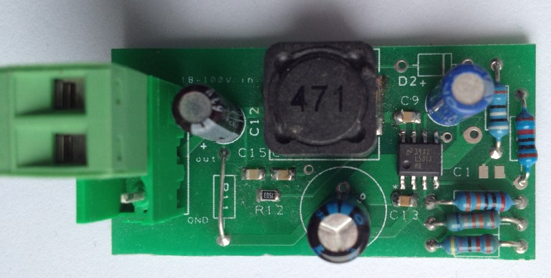

# Wide input voltage range step down converter 
This is just a PCB based on out-of-the-box application note. See [TI site](http://ti.com) for more information.
The best thing about LM5017 is that you can convert from a large (unisolated) voltage without transformer.

PCB also works for LM5018 (300mA) and LM5019 (100mA)

The project in made in DesignSpark PCB.

Finished product:

